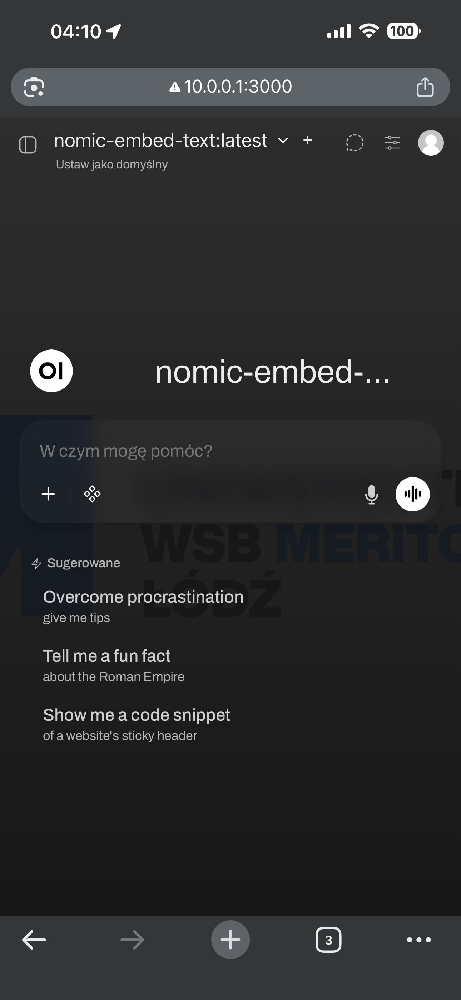
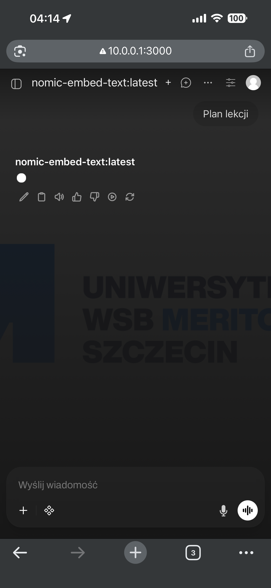
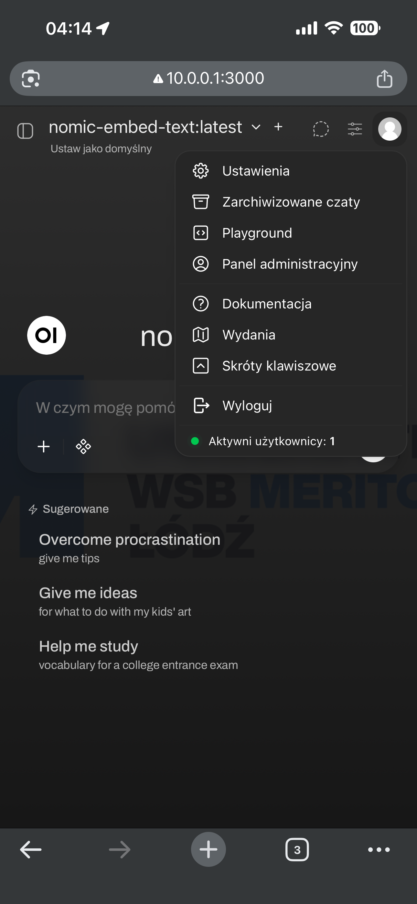
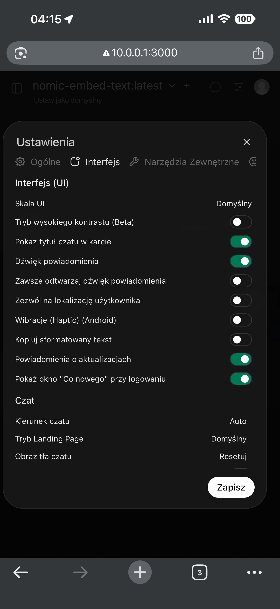
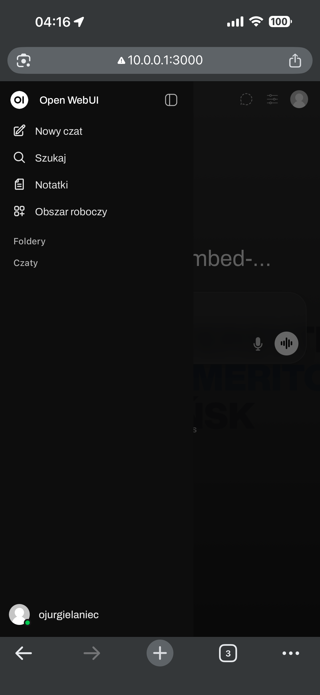

# Raport testów mobilnych – Student Chatbot

**Data:** 11 lutego 2026  
**Tester:** Oskar Jurgielaniec 
**Urządzenie:** iPhone 14 Pro Max  
**Przeglądarka:** Google Chrome  

## Cel testów
Celem testów było sprawdzenie, czy interfejs aplikacji jest poprawnie wyświetlany i w pełni funkcjonalny na urządzeniu mobilnym.

## Zakres testów
Podczas testów sprawdzono:
- logowanie do systemu,
- wysyłanie wiadomości do chatbota,
- odbieranie odpowiedzi,
- nawigację po interfejsie,
- czytelność elementów UI.

## Środowisko testowe
Testy zostały wykonane na rzeczywistym urządzeniu mobilnym bez użycia symulatorów.

- Model: iPhone 14 Pro Max  
- System: iOS  
- Przeglądarka: Chrome  

## Testy funkcjonalne

### Test 1 – Logowanie
**Scenariusz:** Użytkownik loguje się do systemu.  
**Wynik:** OK – proces logowania przebiega poprawnie, wszystkie pola są czytelne i łatwo dostępne.

### Test 2 – Wysłanie promptu
**Scenariusz:** Użytkownik wpisuje pytanie i wysyła je do chatbota.  
**Wynik:** OK – wiadomość została poprawnie wysłana i wyświetlona.

### Test 3 – Odpowiedź chatbota
**Scenariusz:** Użytkownik odbiera odpowiedź.  
**Wynik:** OK – odpowiedź jest czytelna i poprawnie sformatowana.

### Test 4 – Nawigacja
**Scenariusz:** Użytkownik przechodzi między sekcjami aplikacji.  
**Wynik:** OK – interfejs reaguje poprawnie, brak problemów z klikaniem elementów.

## Wyniki
Interfejs aplikacji na urządzeniu mobilnym działa w taki sam sposób jak w wersji desktopowej.  
Nie zaobserwowano problemów z responsywnością, nachodzeniem elementów ani utratą funkcjonalności.

## Wnioski
Aplikacja jest w pełni używalna na urządzeniach mobilnych i nie wymaga dodatkowych modyfikacji interfejsu dla wersji mobilnej.

## Screenshoty testów

### Ekran logowania

### Ekran główny

### Interfejs chatbota

### Wysyłanie zapytania

### Odpowiedź chatbota

### Menu nawigacji

## Maintainers
- Adam Siehen (adamsiehen)
- Patryk Boguski (ptrBoguski)
- Mikołaj Sykucki (zybert)
- Oskar Jurgielaniec (oskarju1)
- Paweł Ponikowski (pponikowski)
