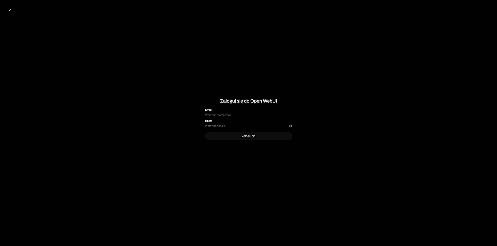
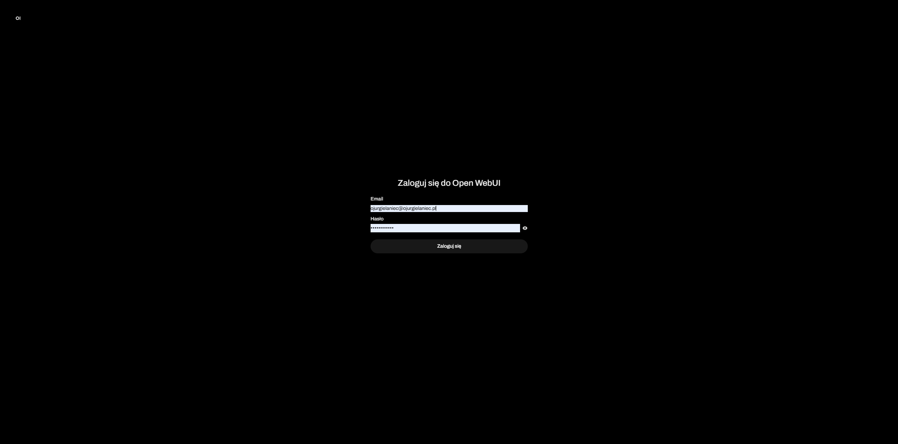
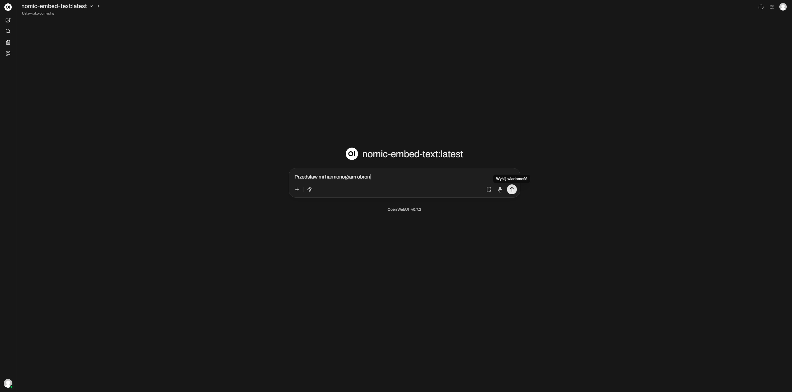
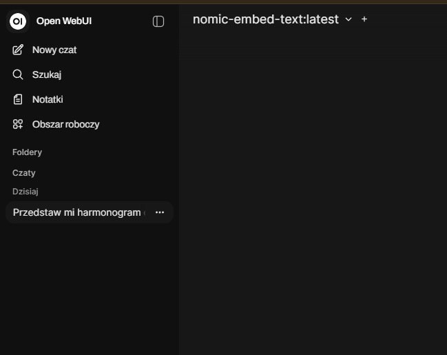

# User Guide – Student Chatbot

## 1. Wprowadzenie
Student Chatbot to aplikacja umożliwiająca zadawanie pytań dotyczących spraw studenckich, takich jak stypendia, procedury administracyjne czy organizacja studiów.

## 2. Uruchomienie aplikacji
Aby uruchomić aplikację, należy otworzyć przeglądarkę internetową i przejść pod adres:
http://localhost:3000

Po uruchomieniu użytkownik zobaczy ekran główny aplikacji.

## 3. Logowanie
Na ekranie logowania należy wprowadzić dane użytkownika.

1. Wpisz login
2. Wpisz hasło
3. Kliknij przycisk "Login"

## 4. Zadawanie pytania
Po zalogowaniu użytkownik może zadać pytanie chatbotowi.

1. Wpisz pytanie w polu tekstowym
2. Kliknij przycisk "Wyślij"
3. Poczekaj na odpowiedź

## 5. Odbieranie odpowiedzi
Odpowiedź zostanie wyświetlona w głównym oknie rozmowy.

Użytkownik może zadawać kolejne pytania bez konieczności ponownego logowania.

## 6. Nawigacja
W menu bocznym dostępne są dodatkowe opcje aplikacji.

## 7. Najczęstsze problemy
- Brak odpowiedzi: sprawdź połączenie z internetem.
- Problem z logowaniem: upewnij się, że dane są poprawne.

## Maintainers
- Adam Siehen (adamsiehen)
- Patryk Boguski (ptrBoguski)
- Miko�aj Sykucki (zybert)
- Oskar Jurgielaniec (oskarju1)
- Paweł Ponikowski (pponikowski)
